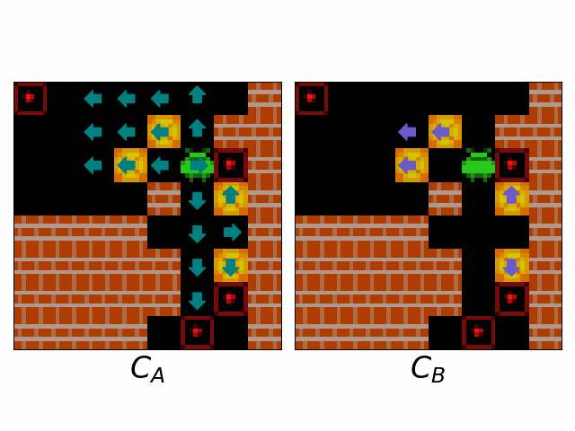

# Interpreting Emergent Planning in Model-Free Reinforcement Learning


This is the official repo for the paper [*Interpreting Emergent Planning in Model-Free Reinforcement Learning*](https://openreview.net/forum?id=DzGe40glxs&referrer=%5BAuthor%20Console%5D). A blog post summarising this paper can be found [here](https://tuphs28.github.io/projects/interpplanning/). This repo builds on the [*Thinker*](https://github.com/stephen-chung-mh/thinker) repo associated with the paper [*Thinker: Learning to Plan and Act*](https://arxiv.org/abs/2307.14993).

Please note that we are still performing additional experiments regarding ResNet agents to add to the Appendix that are not currently included in this repo.

## Table of Contents
- [Installation](#installation)
- [Sokoban Experiments](#sokoban-experiments)
  - [Training Linear Probes](#training-linear-probes)
  - [Visualising Agent Plans](#visualising-agent-plans)
  - [Intervention Experiments](#intervention-experiments)
  - [Investigating Behavioural Evidence of Planning During Training](#investigating-the-emergence-of-behavioural-evidence-of-planning-during-training)
  - [Performing Experiments For Different Agents](#performing-experiments-for-different-agents)
- [Mini Pacman Experiments](#mini-pacman-experiments)
- [Training New Agents](#training-new-agents)

##  Installation
1. Update essential packages and install Cython:

```bash
sudo apt-get update
sudo apt-get install zip python3-opencv build-essential -y
pip install Cython
```

2. Install Sokoban:
```bash
cd sokoban
pip install -e .
```

2. (Optional) Install Mini Pacman:
```bash
cd pilleater
pip install -e .
```

3. Compile and install Thinker:
```bash
cd thinker
pip install -e .
```

4. Install remaining packages used in probing experiments
```bash
cd experiments
pip install -r requirements.txt
```
## Sokoban Experiments

To reproduce the interpretability results on Sokoban, navigate to the `experiments/sokoban_experiments` directory. 
```bash
cd experiments/sokoban_experiments
```
Note that all results here are saved into the `results` directory.

### Training Linear Probes

#### Spatially-Local Probes
To train new spatially-local linear probes for the agent, perform the following steps:
1. Generate a probing training and a test dataset using the following commands
```bash
python3 create_probe_dataset.py --model_name "250m" --num_layers 3 --num_ticks 3 --num_episodes 3000 --name "train"
python3 create_probe_dataset.py --model_name "250m" --num_layers 3 --num_ticks 3 --num_episodes 1000 --name "test" --env_name "valid-"
```

2. Train a $K \times K$ (e.g. $1 \times 1$ or $3 \times 3$) probe to predict feature $FEATURE$ (e.g. either `agent_onto_after` for $C_A$ or `tracked_box_next_push_onto_with` for $C_B$)
 ```bash
python3 train_conv_probe.py --model "250m" --num_layers 3 --feature FEATURE --kernel K --num_epochs 10
```

These probes can be trained for the following square-level concepts/features from the paper:
- `agent_onto_after`: direction which agent steps onto squares from ($C_A$ / AgentApproachDirection)
- `tracked_box_next_push_onto_with`: direction which box is pushed off of squares ($C_B$ / BoxPushDirection)
- `agent_onto`: squares agent will step onto (AgentApproach)
- `tracked_box_next_push_from`: squares that boxes will be pushed off of (BoxPush)
- `agent_onto_with`: direction which agent steps off of squares from (AgentExitDirection)
- `tracked_box_next_push_onto_after`: direction which box is pushed onto squares from (BoxApproachDirection)

#### Spatially-Global Probes
We can also train spatially-global probes to predict the agent's future actions (e.g. `action_ahead_N` for $N \in \\{1, \cdots, 11\\}$) with the following command:
 ```bash
python3 train_full_probe.py --model_name "250m" --num_layers 3 --feature action_ahead_N --num_epochs 10
```


### Visualising Agent Plans

The notebook `visualise_plans.ipynb` contains the code necessary to visualise the agent's internal plans across a range of levels.

### Measuring Plan Correctness Over Ticks

To measure how the correctness of the agent's internal plan (in terms of both $C_A$ and $C_B$) develops over the course of the internal computational ticks the agent performs when given "thinking time" prior to acting, run the following command:
 ```bash
python3 run_plan_acc_exp.py --model_name "250m" --num_layers 3 --num_ticks 3 --num_episodes 1000 --num_thinking_steps 5
```

### Intervention Experiments

The following steps run the intervention experiments:

1. To perform the Agent-Shortcut intervention experiments, run either of the following commands:
```bash
python3 run_agent_interv_exps.py --model_name "250m" --num_layers 3 --num_ticks 3 --num_episodes 200 # perform both short-route and directional intervention (default)
python3 run_agent_interv_exps.py --model_name "250m" --num_layers 3 --num_ticks 3 --num_episodes 200 --noshortrouteinterv # perform only directional intervention
```

2. To perform the Box-Shortcut intervention experiments, run either of the following commands:
```bash
python3 run_box_interv_exps.py --model_name "250m" --num_layers 3 --num_ticks 3 --num_episodes 200 # perform both short-route and directional intervention (default)
python3 run_box_interv_exps.py --model_name "250m" --num_layers 3 --num_ticks 3 --num_episodes 200 --noshortrouteinterv # perform only directional intervention
```


3. To perform the Cutoff intervention experiments, run one of the following commands:
```bash
python3 run_cutoff_interv_exps.py --model_name "250m" --num_layers 3 --num_ticks 3 --num_episodes 200 # perform both agent and box intervention (default)
python3 run_cutoff_interv_exps.py --model_name "250m" --num_layers 3 --num_ticks 3 --num_episodes 200 --noagentinterv # perform only box intervention
python3 run_cutoff_interv_exps.py --model_name "250m" --num_layers 3 --num_ticks 3 --num_episodes 200 --noboxinterv # perform only agent intervention
```

The notebook `visualise_plans.ipynb` also contains the code necessary to visualise the agent's internal plans when the agent is intervened upon.

### Investigating the Emergence of Behavioural Evidence of Planning During Training

To determine the extent to which the agent benefits from additional compute (in terms of the number of additonal levels solved) over the first 50 million transitions of training, run the following:
```bash
python3 run_thinkingtime_exps.py --num_episodes 1000 --num_thinking_steps 5 --range
```

### Performing Experiments For Different Agents
By default, all of the above commands run the Sokoban experiments for the fully-trained DRC(3,3) agent after 250 million transitions. However, these experiments can also be run for other agents whose checkpoints are contained in `checkpoints`:
- **Early DRC(3,3) Agent Checkpoints**: To run experiments for earlier checkpoints of the DRC(3,3) agent, replace `--model_name "250m"` with `--model_name "NUMTRANSITIONSm"` where $NUMTRANSITIONS$ is either an integer between 1 and 50, or 100, 150, or 200.
- **DRC(1,9) Agent**: To run experiments for the DRC(1,9) agent, replace `--model_name "250m"` with `--model_name "100m_d1t9"`, `--num_layers 3` with `--num_layers 1`, and `--num_ticks 3` with `--num_ticks 9`.
- **DRC(9,1) Agent**: To run experiments for the DRC(1,9) agent, replace `--model_name "250m"` with `--model_name "100m_d1t9"`, `--num_layers 3` with `--num_layers 9`, and `--num_ticks 3` with `--num_ticks 1`.

Additionally, the probes can be trained for ResNet agents. To train probes for the 24-block-deep ResNet agent included in this repo, run the probing experiments and replace `--model_name "250m"` with `--model_name "250m_resnet_d24"`, replace `--num_layers 3` with `--num_layers 24` and add the flag `--resnet`.

## Mini Pacman Experiments

Performing experiments on Mini Pacman is very similar to as in Sokoban. To perform these experiments, move to the `experiments/pilleater_experiments` repo.
```bash
cd experiments/sokoban_experiments
```

Then, to train spatially-local probes, perform a similar series of steps as to for Sokoban:

1. Generate a probing training and a test dataset using the following commands
```bash
python3 create_probe_dataset.py --model_name "250m" --num_layers 3 --num_ticks 3 --num_episodes 50 --name "train" --seed 0
python3 create_probe_dataset.py --model_name "250m" --num_layers 3 --num_ticks 3 --num_episodes 30 --name "test" --seed 1
```

2. Train a $K \times K$ (e.g. $1 \times 1$ or $3 \times 3$) probe to predict feature $FEATURE$ (e.g. `agent_onto_after_16` for concept AgentApproachDirection16 or `agent_onto_16` for concept AgentApproach16 )
 ```bash
python3 train_conv_probe.py --model "250m" --num_layers 3 --feature FEATURE --kernel K --num_epochs 10
```

## Training New Agents

To train a new DRC agent in Sokoban, run:

```bash
python3 train.py --xpid new_exp_id --drc true --name "Sokoban-v0" --actor_unroll_len 20 --reg_cost 1 --actor_learning_rate 4e-4 --entropy_cost 1e-2 --v_trace_lamb 0.97 --actor_adam_eps 1e-4 --has_model false --mini true
```

To train this agent instead in Mini Pacman, replace `--name "Sokoban-v0"` with `--name "gym_pilleater/PillEater-v0"`. To instead train a ResNet agent, replace `--drc true` with `--resnet true`.

## Citation
If using this paper or code, please cite us as follows:
```
@inproceedings{
anonymous2024interpreting,
title={Interpreting Emergent Planning in Model-Free Reinforcement Learning},
author={Anonymous},
booktitle={Submitted to The Thirteenth International Conference on Learning Representations},
year={2024},
url={https://openreview.net/forum?id=DzGe40glxs},
note={under review}
}
```
